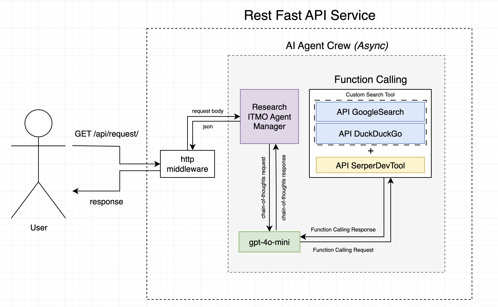
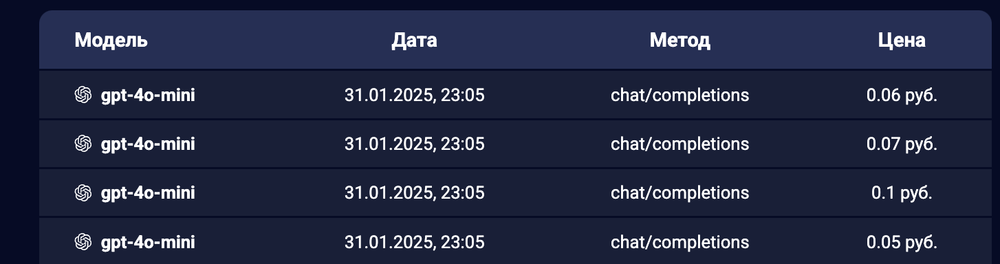

# FastAPI ITMO AI Agent
<div id="stack-badges">
    <a href="https://docs.python.org/3/index.html">
        
    </a>
    <a href="https://www.crewai.com/">
        
    </a>
    <a href="https://www.langchain.com/">
        
    </a>
    <a href="https://docs.python.org/3/library/asyncio.htmll">
        
    </a>
    <a href="https://fastapi.tiangolo.com/">
        
    </a>
    <a href="">
        
    </a>
</div>

-----

**The winner of ITMO Megaschool 2025**: top 9

-----

1. [Архитектура](#архитектура)
2. [Структура репозитория](#структура-репозитория)
3. [Локальный запуск](#локальный-запуск)
   - [Docker](#docker)
   - [Без Docker](#без-docker)
4. [Цена работы](#цена-работы)
5. [Виртуальный хостинг](#виртуальный-хостинг)
6. [Результаты локального тестирования и ограничения API](#результаты-локального-тестирования-и-ограничения-api)

В этом репозитории реализован небольшой FastAPI сервис в рамках тестового задания Мегашколы ИТМО трек ИИ 2025.

**Цель** - сделать FastAPI сервис с AI Агентом, помогающим отвечать на вопросы по тематике, связанной 
с университетом.

## Архитектура

Сервис базируется на нескольких главных составляющих. Весь pipeline выглядит следующим образом:
- При поднятии сервиса инициализируется Crew Agent с proxy на OpenAI модель
- FastAPI на эндпоинт `api/request` берет запрос
- Body запроса отправляется в async kickoff-loop ИИ агента
  - Агент Researcher принимает запрос
  - Агент Researcher выполняет Researcher Task в async с Function Calling
    - Задача вызывает кастомный SearchTool с походом в GoogleResearch и DuckDuckGo клиенты (REST клиенты поисковых движков)
    - Задача вызывает встроенный SerperDevTool
- Заканчивается цикл, возвращается ответ



Структура репозитория: 
 
```shell
📦 itmo-megaschool-2025/  
├── 📂 experiments/      # Артефакты экспериментов и пробные запуски других pipeline-ов  
├── 📂 src/              # Исходный код проекта  
│   ├── 📂 agent/        # Логика работы AI-агента  
│   │   ├── 📂 config/   # Конфигурационные файлы агента и заданий  
│   │   ├── agents.py    # Основной AI Agent Crew pipeline  
│   │   └── tools.py     # Кастомный tool для Function Calling  
│   ├── 📂 clients/      # Клиенты для работы с внешними API (поисковые системы)  
│   │   ├── duckduckgo.py # Клиент для DuckDuckGo  
│   │   └── google.py    # Клиент для Google Search  
│   ├── 📂 schemas/      # Определения структур Request и Response  
│   └── 📂 utils/        # Вспомогательные утилиты (логирование и др.)  
├── .env                 # Переменные окружения  
├── .gitignore           # Файл для исключения из Git ненужных файлов  
├── docker-compose.yaml  # Конфигурация Docker Compose для запуска контейнеров  
├── Dockerfile           # Docker-образ проекта  
├── main.py              # Главный входной файл приложения  
├── requirements.txt     # Список зависимостей проекта  
└── start.sh             # Скрипт для запуска проекта  
```

## Локальный запуск

Проект можно запустить в docker-контейнере, либо же без него. Во втором случае советуется 
заранее собрать отдельное venv или conda окружение.

Для работы проекта необходимо сконфигурировать приложение в [`.env`](.env) файле. Пропишите 
свои OpenAI переменные. Для Google Search переменных знакомимся с документацией [здесь](https://developers.google.com/custom-search/v1/overview).
Для SerperAPI бесплатный ключ можно найти при [регистрации](https://serper.dev).

### Docker
Собираем образ и поднимаем контейнер с проектом:
```shell
docker-compose up -d
```
После успешного запуска контейнера приложение будет доступно на `http://localhost:8080`. Теперь можно посылать `GET` запросы
вида:

```shell
curl --location --request POST 'http://localhost:8080/api/request' \
--header 'Content-Type: application/json' \
--data-raw '{
  "query": "YOUR QUESTION",
  "id": INT
}'
```

Для остановки контейнера можно запустить:
```shell
docker-compose down
```
### Без Docker 
Устанавливаем все зависимости:
```shell
pip install --no-cache-dir -r requirements.txt
```
В случае запуска вне контейнера достаточно просто прописать в корне репозитория:
```shell
sh starh.sh
```
Адрес для доступа остается таким же, как и в предыдущем варианте.

## Цена работы

Все поисковые API являются бесплатными. В итоговом варианте используется OpenAI `gpt-4o-mini` через сторонний proxy сервис российского провайдера,
поэтому цена отличается от официальной. Постфактум цена за один вопрос к системе считается из 2-3 запросов к модели, 
что суммарно получается порядка 30 копеек. 



## Виртуальный хостинг

Хостинг модели для сдачи работы происходит на личном ПК через сервис [`tuna`](https://tuna.am/) следующим образом:

```shell
tuna http 8080 --subdomain=<your_subdomain> --rate-limit=25
```

## Результаты локального тестирования и ограничения API

В удаленно поднятом API стоит Rate Limiter на 25 запросов в моменте.
Общее время выполнение 100 запросов находится между 4 и 7 минутами в зависимости от размера
вопроса и количества подаваемых запросов в моменте.

Стоит отметить, что если "спамится" один и тот же запрос, то GoogleSearch и DuckDuckGo API 
перестают работать по внутреннему Rate Limiter-у. В размерах до 100 запросов включительно, это
не слишком проблемный фактор. API рассчитано на не более чем 25 RPS 

Ограничения зависимых поисковых API:

|   Free API    |        Limit        | 
|:-------------:|:-------------------:|
| Google Search |     100 per day     |
|  DuckDuckGo   |       no info       |
|   SerperDev   | first 2500 requests |

При этом агент умеет в **кэширование** *(отдельная функция памяти отключена, т.к. gpt эмбеддер имеет баг в `openai` формате)* предыдущих запросов.
